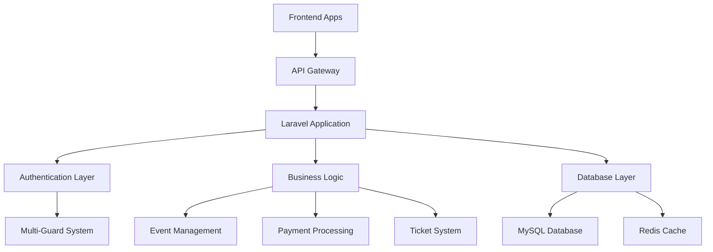

# Makankom - Event Ticketing Platform 🎫

<div align="center">

[](https://laravel.com)
[](https://php.net)
[](https://mysql.com)
[]()

**A comprehensive dual-language event management and ticketing platform for Oman**

[Features](#features) • [Installation](#installation) • [API Documentation](#api-documentation) • [Contributing](#contributing)

</div>

---

## 📋 Table of Contents

- [About The Project](#about-the-project)
- [Features](#features)
- [Technology Stack](#technology-stack)
- [System Architecture](#system-architecture)
- [User Roles](#user-roles)
- [Project Progress](#project-progress)
- [Installation](#installation)
- [API Reference](#api-reference)
- [Database Schema](#database-schema)
- [Testing](#testing)
- [Deployment](#deployment)
- [Contributing](#contributing)
- [License](#license)

---

## 🌟 About The Project

Makankom is a sophisticated event management and ticketing platform designed specifically for the Oman market. The platform bridges the gap between event organizers and attendees, providing a seamless experience for discovering, booking, and attending various events - both physical and virtual.

### Key Highlights

- **🌐 Dual Language Support**: Complete Arabic (RTL) and English (LTR) interfaces
- **🔐 Multi-Role System**: Four distinct user types with specialized functionalities
- **💳 Payment Integration**: Thawani and AmwalPay gateway support
- **📱 Mobile-Ready**: API-first architecture supporting web and mobile clients
- **🎯 Event Lifecycle**: Complete management from creation to ticket scanning
- **📊 Analytics**: Comprehensive reporting and insights

---

## ✨ Features

### 🎭 For Customers
- [x] Event discovery with advanced filtering
- [x] Multi-gateway payment processing
- [x] Digital ticket management with QR codes
- [x] Wishlist and purchase history
- [x] Social sharing capabilities
- [ ] Event reviews and ratings (v1.1)

### 🏢 For Organizers
- [x] Event creation and management
- [x] Multiple ticket type configurations
- [x] Sales analytics and reporting
- [x] Brand management
- [x] Scan point administration
- [ ] Marketing tools and promotions (v1.1)

### 👨‍💼 For Administrators
- [x] Event approval workflow
- [x] User management and verification
- [x] Platform content moderation
- [x] Financial reporting
- [x] System configuration
- [ ] Advanced analytics dashboard (v1.1)

### 📱 For Scan Points
- [x] Real-time ticket validation
- [x] QR code scanning interface
- [x] Offline scanning with sync
- [x] Attendance tracking
- [x] Entry statistics

---

## 🛠 Technology Stack

### Backend
| Technology | Version | Purpose |
|------------|---------|---------|
| **Laravel** | 12.x | Main framework |
| **PHP** | 8.2+ | Server-side language |
| **MySQL** | 8.0+ | Primary database |
| **Redis** | 6.0+ | Caching & sessions |
| **Sanctum** | 4.x | API authentication |

### Development Tools
| Tool | Purpose |
|------|---------|
| **Composer** | PHP dependency management |
| **NPM** | Frontend asset management |
| **Vite** | Asset bundling |
| **PHPUnit** | Testing framework |

---

## 🏗 System Architecture



### API Architecture
- **RESTful Design**: Consistent endpoint patterns
- **Token Authentication**: JWT-based security
- **Multi-Guard System**: Role-based access control
- **Standardized Responses**: Uniform JSON structure
- **Rate Limiting**: Protection against abuse

---

## 👥 User Roles

<table>
<tr>
<td width="25%">

### 🛍 Customer
- Browse events
- Purchase tickets
- Manage profile
- View history
- Wishlist items

</td>
<td width="25%">

### 🏢 Organizer
- Create events
- Manage tickets
- View analytics
- Upload media
- Control access

</td>
<td width="25%">

### 👨‍💼 Admin
- Approve content
- Manage users
- Platform settings
- View reports
- Moderate system

</td>
<td width="25%">

### 📱 Scan Point
- Validate tickets
- Scan QR codes
- Track attendance
- Generate reports
- Offline support

</td>
</tr>
</table>

---

## 📊 Project Progress

<div align="center">

### Overall Completion: **85%**

</div>

#### ✅ Completed (100%)
- Database schema and migrations
- Authentication system (all user types)
- Core API endpoints
- File upload system
- Email notification system

#### 🔄 In Progress (60-90%)
- Event management (95%)
- Order processing (90%)
- Ticket system (95%)
- Admin features (85%)
- Payment integration (60%)

#### ⏳ Pending (0-30%)
- Comprehensive testing (30%)
- API rate limiting (0%)
- Production configuration (20%)
- API documentation (10%)

---

## 🚀 Installation

### Prerequisites

Ensure you have the following installed:

```bash
PHP >= 8.2
Composer >= 2.0
Node.js >= 18.0
MySQL >= 8.0
```

### Quick Start

1. **Clone the repository**
   ```bash
   git clone https://github.com/yourusername/makankom.git
   cd makankom
   ```

2. **Install dependencies**
   ```bash
   composer install
   npm install
   ```

3. **Environment setup**
   ```bash
   cp .env.example .env
   php artisan key:generate
   ```

4. **Database configuration**
   
   Edit `.env` file:
   ```env
   DB_CONNECTION=mysql
   DB_HOST=127.0.0.1
   DB_PORT=3306
   DB_DATABASE=makankom_app_2
   DB_USERNAME=your_username
   DB_PASSWORD=your_password
   ```

5. **Database migration**
   ```bash
   php artisan migrate
   php artisan db:seed  # Optional: sample data
   ```

6. **Storage setup**
   ```bash
   php artisan storage:link
   chmod -R 775 storage bootstrap/cache
   ```

7. **Asset compilation**
   ```bash
   npm run build  # Production
   npm run dev    # Development
   ```

8. **Start development server**
   ```bash
   php artisan serve
   ```

### 🌐 Access URLs

- **Application**: http://localhost:8000
- **API Base**: http://localhost:8000/api/
- **API Documentation**: http://localhost:8000/api/documentation

---

## 📚 API Reference

### Authentication Endpoints

#### Customer Authentication
```http
POST /api/customer/register
POST /api/customer/login
POST /api/customer/logout
```

#### Organizer Authentication
```http
POST /api/organizer/register
POST /api/organizer/login
POST /api/organizer/logout
```

### Core Endpoints

#### Public Events
```http
GET    /api/v1/events              # List events
GET    /api/v1/events/{id}         # Event details
GET    /api/v1/event-categories    # Categories
```

#### Customer Features
```http
GET    /api/customer/orders        # Order history
POST   /api/customer/orders        # Create order
GET    /api/customer/tickets       # My tickets
POST   /api/customer/wishlist      # Add to wishlist
```

### Sample Request

```bash
curl -X POST http://localhost:8000/api/customer/register \
  -H "Content-Type: application/json" \
  -d '{
    "first_name": "John",
    "last_name": "Doe", 
    "email": "john@example.com",
    "password": "password123",
    "password_confirmation": "password123"
  }'
```

### Response Format

```json
{
  "success": true,
  "message": "Customer registered successfully",
  "data": {
    "customer": { ... },
    "token": "eyJ0eXAiOiJKV1QiLCJhbGciOiJIUzI1NiJ9..."
  }
}
```

---

## 🗄 Database Schema

### Core Tables

| Table | Purpose | Relations |
|-------|---------|-----------|
| `customers` | Customer accounts | → orders, tickets, wishlists |
| `organizers` | Event organizers | → events, brands |
| `events` | Event information | → tickets, orders |
| `orders` | Purchase records | → order_items, payments |
| `tickets` | Digital tickets | → ticket_scans |

### Relationships Overview

```
customers (1) ──→ (n) orders ──→ (n) order_items
                     ↓
events (1) ──→ (n) ticket_types ──→ (n) tickets
    ↓
organizers (1) ──→ (n) brands
```

---

## 🧪 Testing

### Run Test Suite

```bash
# All tests
php artisan test

# Specific test file
php artisan test tests/Feature/API/AuthenticationTest.php

# With coverage
php artisan test --coverage
```

### Test Categories

- **Feature Tests**: API endpoint testing
- **Unit Tests**: Service and model testing
- **Integration Tests**: External service testing

---

## 🚀 Deployment

### Production Checklist

- [ ] Environment variables configured
- [ ] SSL certificates installed
- [ ] Redis cache configured
- [ ] Queue workers running
- [ ] Database backups automated
- [ ] Monitoring tools setup
- [ ] Error tracking enabled

### Environment Configuration

```env
APP_ENV=production
APP_DEBUG=false
APP_URL=https://yourdomain.com

DB_CONNECTION=mysql
CACHE_DRIVER=redis
QUEUE_CONNECTION=redis

MAIL_MAILER=smtp
PAYMENTS_ENABLED=true
```

---

## 🤝 Contributing

### Development Workflow

1. **Fork** the repository
2. **Create** feature branch (`git checkout -b feature/amazing-feature`)
3. **Commit** changes (`git commit -m 'Add amazing feature'`)
4. **Push** to branch (`git push origin feature/amazing-feature`)
5. **Open** a Pull Request

### Code Standards

- Follow **PSR-12** coding standards
- Write **comprehensive tests** for new features
- Update **documentation** for API changes
- Use **meaningful commit messages**

### Development Setup

```bash
# Install development dependencies
composer install --dev
npm install

# Run code style checks
./vendor/bin/pint

# Run tests before committing
php artisan test
```

---

## 📝 License

This project is proprietary software. All rights reserved.

---

## 📞 Contact & Support

<div align="center">

**Developer**: Mr. Khalfan Alamri  
**Email**: support@makankom.om  
**Project**: [GitHub Repository](https://github.com/yourusername/makankom)

---

<sub>Built with ❤️ for the Oman event community</sub>

</div>
